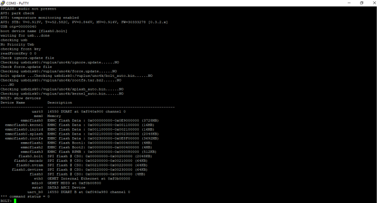

# dvb-receiver-recovery
Recovery of open source dvb receivers using the linux operating system and the Enigma2 application


> **⚠ IMPORTANT, PLEASE READ**  
> This repository is for troubleshooting documentation only. This is not a forum for placing your own technical problems. Thus the following applies:
> * What ever you do - you do it on your own risk.
> * Contributions to help others in the form of pull requests are welcome. 
> * Please refrain from posting issues.

<!-- TOC -->

- [dvb-receiver-recovery](#dvb-receiver-recovery)
    - [INITIAL SITUATION](#initial-situation)
    - [SUSPECTED CAUSE OF ERROR](#suspected-cause-of-error)
    - [DIFFERENCE OF IMAGES](#difference-of-images)
    - [FLASHING IMAGE BY USB DEVICE PREFERED](#flashing-image-by-usb-device-prefered)
    - [ENABLE FORCE MODE](#enable-force-mode)
    - [A QUICK OVERVIEW OF A MICROCONTROLLER](#a-quick-overview-of-a-microcontroller)
    - [ACCESS BOOTLOADER MODE BY RS232](#access-bootloader-mode-by-rs232)
    - [PUTTY RS232 CONNECTION](#putty-rs232-connection)
    - [USE OF BCM / BOLT](#use-of-bcm--bolt)
        - [INTERRUPT THE BOOT PROCESS](#interrupt-the-boot-process)
        - [KERNEL IMAGE](#kernel-image)
        - [ANALYZING EXISTING DEVICES](#analyzing-existing-devices)
        - [INSTALL NEW KERNEL](#install-new-kernel)
    - [LICENSE](#license)

<!-- /TOC -->

## INITIAL SITUATION
After an unsuccessful update of OpenPLI from Version 7 to 8.1 stable release on a ZGEMMA H7.S receiver it did not boot anymore. This has turned out as follows: 
* ZGemma receiver has shown only "Boot" in the display after startup
* Switching to flash mode was no longer possible by pressing the front power button

## SUSPECTED CAUSE OF ERROR
Since flashing the new OpenPLI image with a USB stick was not possible, I used the menu item "Update to latest release and reboot". Cause I read it in here: https://wiki.openpli.org/Releases
* Major releases (like 7 => 8) you must flash, preferably using the menu and choosing the backup option, then everything is restored after the flash. When there is no Hard disk present use an USB stick.

## DIFFERENCE OF IMAGES
Depending on PVR distribution and receiver manufacturer there are different images, here should be used in principle "stable releases".

| Extension  | Description |
| ------------- | ------------- |
| {distribution-release-date}_usb.zip | Default image without multiboot options |
| {distribution-release-date}_multiboot.zip | Many Vendors offer multiboot, this receiver specific feature, when available makes it possible to install multiple images on a receiver. So like 3 or more versions of PLi, how much images you can install when it is supported depends on the slots, let's say the partitions that are present. |
| {distribution-release-date}_recovery_emmc.zip | With the recovery_emmc.zip also the individual boot areas are repartitioned |

## FLASHING IMAGE BY USB DEVICE (PREFERED)

* Prepare USB stick
  * Low level format your usb stick with e.g. SD Card Formater (https://www.sdcard.org/downloads/formatter/)
  * Format a USB stick to FAT32
* Download
  * Download the image of your choice (https://openpli.org/download) and extract it to your desktop. Do not extract it directly to your usb device.
  * Open the folder you extracted to your desktop, see another folder named "zgemma," this has to be copied to USB stick.
  * The USB stick should always be disconnected using the Windows function "Safely Remove Hardware" before physically removing it.
* Power off the receiver
* Ensure no other USB devices are plugged into the receiver
* Insert USB device
  * Insert the USB device containing the image
  * Best practices: For usb devices <= 8 GB use the USB2.0 connectors, < 8GB the USB3.0 connector
* Power the receiver on on backside switch


* Immediately after powering on PRESS AND HOLD the front power button


* Display appears FLSH on front display, release the power button
* If successful the receiver will reboot it self after the flashing process has completed.
* Remove USB stick that contains the images files.

## ENABLE FORCE MODE
If no additional or “noforce” file is present in the h7 subfolder, please make sure to create or rename it to “force” without any file extensions.

## A QUICK OVERVIEW OF A MICROCONTROLLER 
| Stage  | Description |
| ------------- | ------------- |
| Raw Chip | An integrated circuit or monolithic integrated circuit is a set of electronic circuits on one small flat piece (or "chip") of semiconductor material. |
| Bootloader | A bootloader is an application whose main goal is to update/modify the system software without the use of special firmware upgrade tools. Bootloaders can have many functions, but are mainly used to manage the application. |
| BOLT / CTC | A firmware interface and boot loader, It is a flexible toolkit for CPU initialization and bootstrap code for use on embedded processors. It is roughly comparable to the BIOS on the PC platform. In context with dvb-recorders access to this interface can be taken over a RS232 interface. |
| Flash | Flash memory is an electronic non-volatile computer memory storage medium that can be electrically erased and reprogrammed. | 
| EEPROM | EEPROM stands for "electrically erasable programmable read-only memory" and is a type of non-volatile memory. |
| Application Firmware | Firmware is a specific class of computer software that provides low-level control of a device's specific hardware. In this case a dvb distribution such as OpenPLI, OpenATV, among others. |

## ACCESS BOOTLOADER MODE BY RS232
Access the bootloader mode of receiver using a terminal, in this example putty through the rs232 connection.


In this way, once we have accessed our receiver in bootloader mode, we can:
* View the boot log of the receiver.
* Execute commands from the terminal, such as for example to insert files into the flash partitions of our receiver.

For this we will need:
* The putty program for our pc, you can download it from the official link here (https://www.putty.org)
* a 6-pin RJ adapter db9female (RJ232), with the following connections:

https://www.az-delivery.de/en/products/ftdi-adapter-ft232rl (buy it at the reseller of your trust)


```
ZGemma RS232                                     FTDI Adapter
                 ——————— GND ———— GND ———————— 
                 ———————— RX ———— TX ————————— 
                 ———————— TX ———— RX ————————— 
                 ——————— VCC ———— VCC ———————— 
```
* Note: RX and TX must be cross wired

Now with the receiver turned off, we connect the receiver to the pc through the connection port of our receiver. 

## PUTTY RS232 CONNECTION
Then open putty on our pc and configure as follows:

* Connection Type: Serial
* Serial Line: COM1
* Speed: 115200 (bits per second)


Taking into account replace COM1 with the rs232 port used by your pc, and then click on open, and then turn on the receiver of the current and if everything went well we will observe the startup log and processes of the receiver.

Among other things we can see for example the bootloader version that we have installed
In this way, if the log appears, we already know that we made the rs232 connections correctly.

## USE OF BCM / BOLT
### INTERRUPT THE BOOT PROCESS
Now we are going to see how to put the receiver in bootloader mode, for this we repeat the previous steps but when we start to see the log press 
```
control + C
```
on the keyboard of our pc, and the log will stop remaining as the image shows

### KERNEL IMAGE
The kernel image is contained in every .img file of a PVR distribution. To extract it, simply using a ZIP program (7Zip, PeaZip, etc.) is not sufficient. The image should be extracted to a USB device with e.g. ImageBurn (https://www.imgburn.com/index.php?act=download).

### ANALYZING EXISTING DEVICES
Once the receiver is in bootloader mode, it allows us to execute commands in it, we can use help to see what commands we can use, this time we are going to do the example to introduce kernel in our receiver in case it has caused a blockage, To do this, the first thing is to know the partitions for this we execute:
```
show devices
```
As we can see, the memory area for the introduction of the kernel is __emmcflash0.kernel__, since then we insert the kernel of our receiver on a pendrive, for example at the root of it:



Later we introduce the pendrive in the usb of the receiver and we will observe in the log that it is recognized

### INSTALL NEW KERNEL
install the kernel we will use the following command:
```
flash usbdisk0:kernel.bin emmcflash0.kernel
```

And after pressing enter we will see that it has been installed correctly


Now we could remove the rs232 connection and execute reboot in the terminal and the receiver would start normally with the kernel that we have installed.

## LICENSE
dvb-receiver-recovery and all individual scripts are under the BSD 3-Clause license unless explicitly noted otherwise. Please refer to the LICENSE